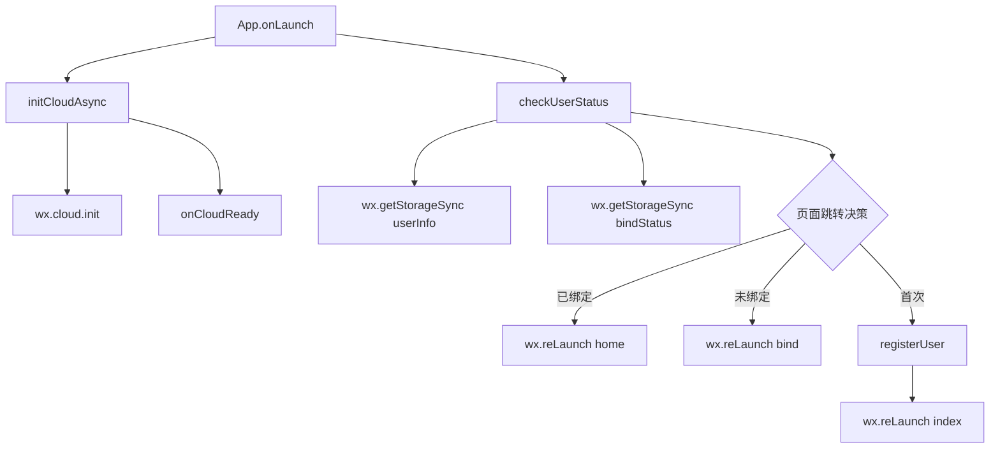
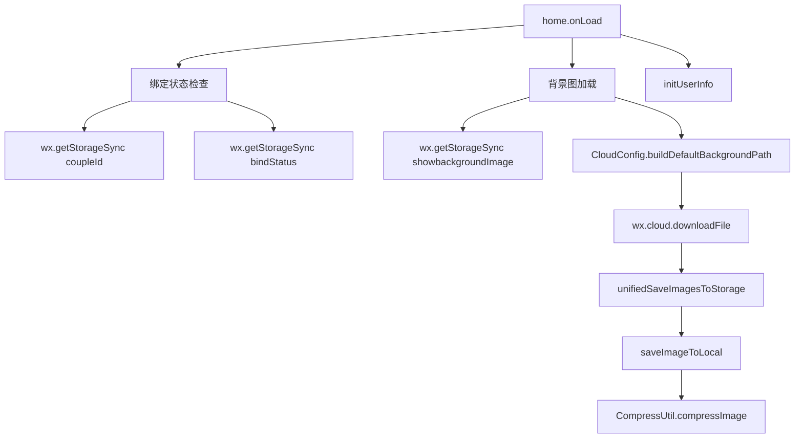
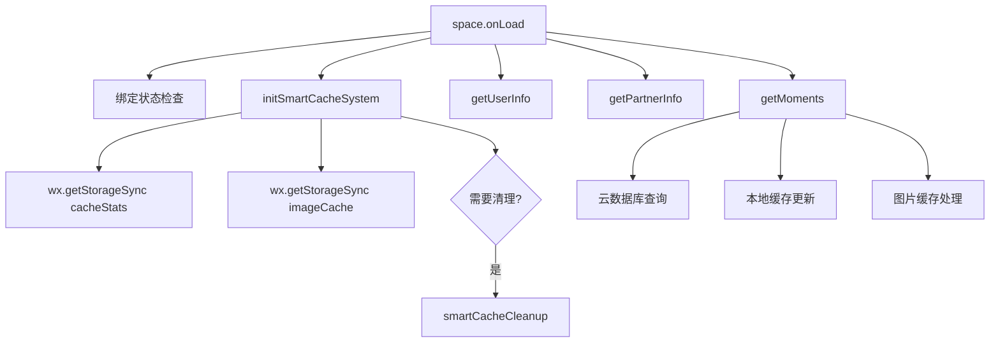
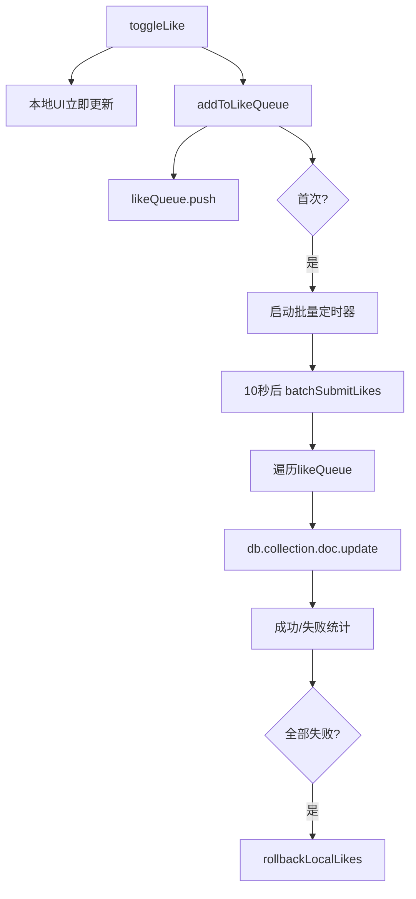
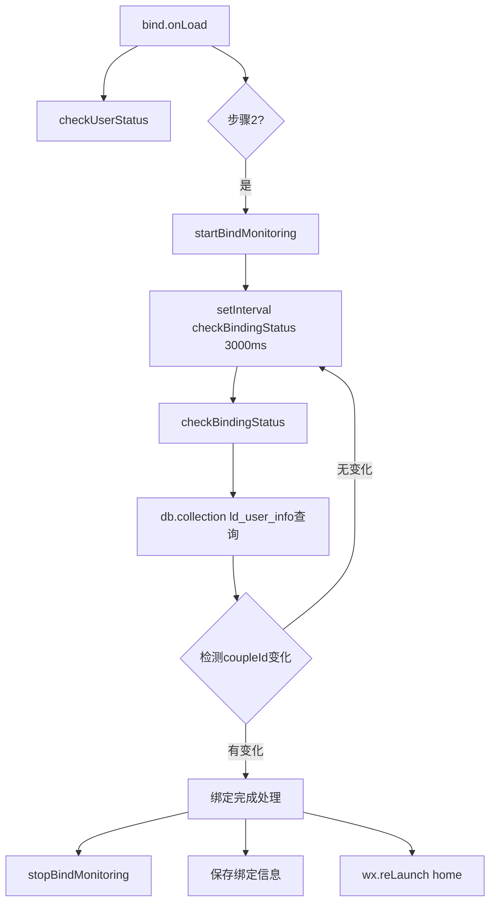
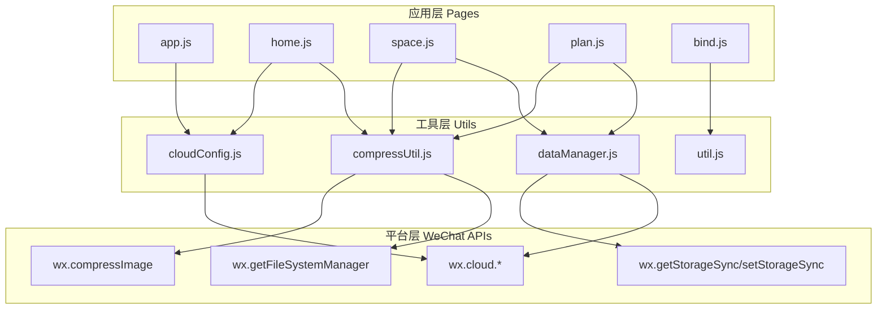
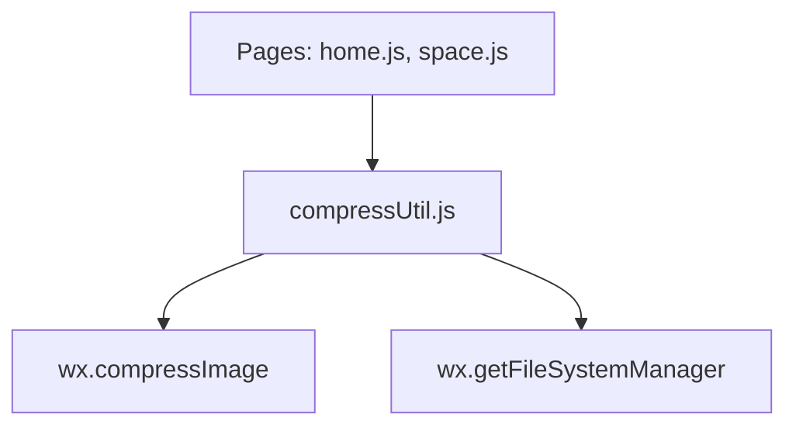
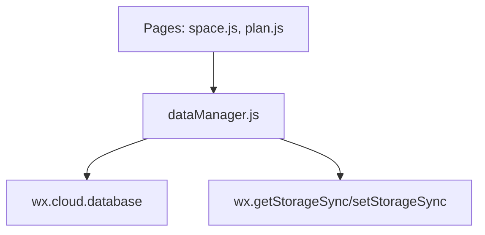
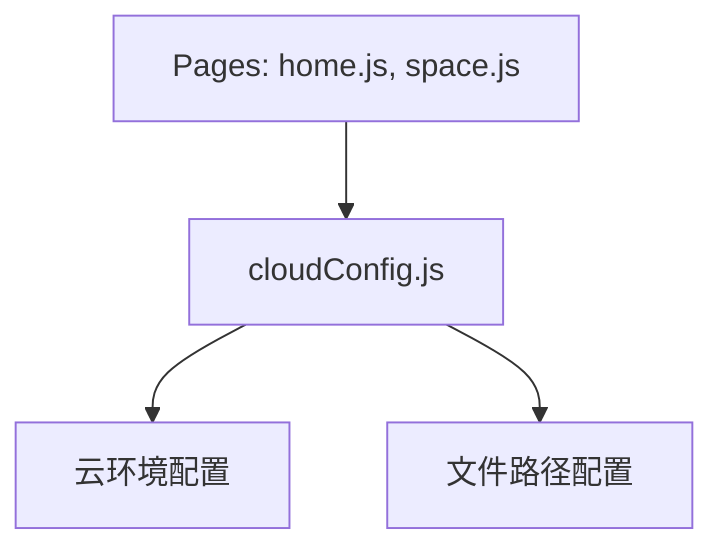

# Love Diary 项目函数调用关系分析

## 1. 核心函数识别

### 1.1 主要入口函数

#### App.js - 应用入口

- **onLaunch()** - 应用启动入口

  - 作用：异步初始化云开发，检查用户状态
  - 调用：`initCloudAsync()`, `checkUserStatus()`
- **initCloudAsync()** - 云开发初始化

  - 作用：异步初始化微信云开发环境
  - 调用：`wx.cloud.init()`, `onCloudReady()`
- **checkUserStatus()** - 用户状态检查

  - 作用：检查用户注册和绑定状态，决定页面跳转
  - 调用：`wx.getStorageSync()`, `wx.reLaunch()`, `registerUser()`

### 1.2 页面核心函数

#### home.js - 首页管理

- **onLoad()** - 页面加载

  - 作用：检查绑定状态，加载背景图和轮播图
  - 调用：`wx.getStorageSync()`, `CloudConfig.buildDefaultBackgroundPath()`, `initUserInfo()`
- **saveImageToLocal()** - 图片本地保存

  - 作用：压缩并保存图片到本地永久路径
  - 调用：`CompressUtil.compressImage()`, `wx.getFileSystemManager().saveFile()`
- **unifiedSaveImagesToStorage()** - 批量图片保存

  - 作用：批量压缩保存多张图片
  - 调用：`saveImageToLocal()`, `wx.showLoading()`, `wx.setStorageSync()`

#### space.js - 情侣空间

- **onLoad()** - 页面初始化

  - 作用：检查绑定状态，初始化缓存系统，获取用户信息
  - 调用：`initSmartCacheSystem()`, `getUserInfo()`, `getPartnerInfo()`, `getMoments()`
- **initSmartCacheSystem()** - 智能缓存初始化

  - 作用：初始化图片缓存映射和缓存统计
  - 调用：`wx.getStorageSync()`, `smartCacheCleanup()`
- **toggleLike()** - 点赞功能（批量优化版）

  - 作用：本地UI更新，添加到点赞队列
  - 调用：`addToLikeQueue()`, 本地数据更新
- **batchSubmitLikes()** - 批量提交点赞

  - 作用：每10秒批量提交点赞到云端
  - 调用：`db.collection().doc().update()`, `rollbackLocalLikes()`

#### plan.js - 计划管理

- **onLoad()** - 页面加载

  - 作用：检查绑定状态，初始化用户信息，加载计划统计
  - 调用：`initUserInfo()`, `loadPlanCountsFromCloud()`
- **loadPlanCountsFromCloud()** - 加载计划统计

  - 作用：从云端获取各类计划的数量统计
  - 调用：云数据库查询，本地缓存更新

#### bind.js - 绑定流程

- **onLoad()** - 页面加载

  - 作用：检查用户状态，初始化绑定流程
  - 调用：`checkUserStatus()`
- **startBindMonitoring()** - 启动绑定监控

  - 作用：定时检查绑定状态
  - 调用：`setInterval()`, `checkBindingStatus()`
- **checkBindingStatus()** - 检查绑定状态

  - 作用：查询用户记录，检测是否被绑定
  - 调用：`db.collection().where().get()`, 绑定完成处理

### 1.3 工具类函数

#### dataManager.js - 数据管理

- **constructor()** - 数据管理器初始化

  - 作用：配置缓存参数，初始化状态
  - 调用：`initSmartCacheSystem()`
- **initSmartCacheSystem()** - 智能缓存系统

  - 作用：加载缓存统计，检查清理需求
  - 调用：`wx.getStorageSync()`, `smartCacheCleanup()`

#### compressUtil.js - 图片压缩

- **compressImage()** - 图片压缩
  - 作用：压缩图片到指定大小
  - 调用：`wx.getFileSystemManager().stat()`, `wx.compressImage()`

#### cloudConfig.js - 云配置

- **getCurrentCloudEnvId()** - 获取云环境ID

  - 作用：返回当前云开发环境ID
- **buildDefaultBackgroundPath()** - 构建默认背景路径

  - 作用：构建云存储文件路径

## 2. 调用链路分析

### 2.1 应用启动流程



### 2.2 首页加载流程



### 2.3 情侣空间加载流程



### 2.4 点赞批量处理流程



### 2.5 绑定流程



## 3. 模块间依赖关系

### 3.1 依赖层次结构


### 3.2 核心依赖关系

#### 图片压缩依赖链


#### 数据管理依赖链


#### 云配置依赖链


### 3.3 import/include关系

#### 页面文件引用

```javascript
// home.js
const CompressUtil = require('../../utils/compressUtil');
const CloudConfig = require('../../utils/cloudConfig');

// space.js
const CompressUtil = require('../../utils/compressUtil');

// plan.js
const CompressUtil = require('../../utils/compressUtil');
```

#### 工具类内部依赖

```javascript
// dataManager.js - 独立工具类，无外部依赖
// compressUtil.js - 独立工具类，无外部依赖
// cloudConfig.js - 独立配置类，无外部依赖
```

## 4. 关键性能优化点

### 4.1 异步处理

- **云开发初始化**：App.js中异步初始化，避免阻塞启动
- **图片压缩**：使用Promise包装，支持async/await
- **批量点赞**：10秒批量提交，减少数据库访问频率

### 4.2 缓存机制

- **智能缓存系统**：dataManager.js提供统一缓存管理
- **图片缓存**：space.js实现图片本地缓存和智能清理
- **数据缓存**：各页面实现本地数据缓存

### 4.3 懒加载

- **分页加载**：space.js实现瞬间数据分页加载
- **按需清理**：定时清理过期缓存数据

## 5. 架构特点总结

### 5.1 优点

1. **模块化设计**：工具类独立，页面逻辑清晰
2. **统一管理**：图片压缩、云配置、数据管理统一封装
3. **性能优化**：批量处理、缓存机制、异步加载
4. **代码复用**：工具类被多个页面复用

### 5.2 依赖特征

1. **单向依赖**：页面依赖工具类，工具类依赖平台API
2. **松耦合**：各模块职责明确，依赖关系清晰
3. **可维护性**：工具类变更不影响页面逻辑
4. **可扩展性**：新增功能可复用现有工具类

## 6. 项目优化建议

### 6.1 代码质量优化

#### 6.1.1 错误处理机制
**问题**：当前项目缺乏统一的错误处理机制
- 云数据库操作缺少try-catch包装
- 网络请求失败时用户体验不佳
- 缺少全局错误监控

**建议**：
```javascript
// 创建统一错误处理工具类
class ErrorHandler {
  static async handleCloudError(operation, fallback) {
    try {
      return await operation();
    } catch (error) {
      console.error('云操作失败:', error);
      wx.showToast({ title: '操作失败，请重试', icon: 'none' });
      return fallback ? fallback() : null;
    }
  }
}
```

#### 6.1.2 代码重复问题
**问题**：多个页面存在相似的初始化逻辑
- 绑定状态检查代码重复
- 用户信息获取逻辑分散
- 页面跳转逻辑重复

**建议**：
```javascript
// 创建页面基类
class BasePage {
  static checkBindStatus() {
    const coupleId = wx.getStorageSync('coupleId');
    const bindStatus = wx.getStorageSync('bindStatus');
    if (!coupleId || !bindStatus) {
      wx.reLaunch({ url: '/pages/bind/bind' });
      return false;
    }
    return true;
  }
}
```

### 6.2 性能优化建议

#### 6.2.1 图片加载优化
**问题**：图片加载策略可以进一步优化
- 缺少图片预加载机制
- 没有图片懒加载
- 图片压缩质量固定

**建议**：
```javascript
// 智能图片加载管理器
class ImageLoadManager {
  static async preloadImages(urls, priority = 'low') {
    // 根据网络状态调整预加载策略
    const networkType = await this.getNetworkType();
    if (networkType === 'wifi') {
      return this.batchPreload(urls);
    }
    return this.lazyPreload(urls);
  }
  
  static adaptiveCompress(fileSize) {
    // 根据文件大小自适应压缩质量
    if (fileSize > 2 * 1024 * 1024) return 0.6;
    if (fileSize > 1 * 1024 * 1024) return 0.7;
    return 0.8;
  }
}
```

#### 6.2.2 数据库查询优化
**问题**：数据库查询效率有提升空间
- 缺少索引优化建议
- 没有查询结果缓存策略
- 分页查询可以优化

**建议**：
```javascript
// 数据库索引建议
const indexSuggestions = {
  'ld_moments': ['coupleId', 'createTime'], // 复合索引
  'ld_user_info': ['openId', 'coupleId'],
  'ld_plans': ['coupleId', 'planType', 'createTime']
};

// 智能查询缓存
class QueryCache {
  static async cachedQuery(collection, query, cacheKey, ttl = 300000) {
    const cached = wx.getStorageSync(cacheKey);
    if (cached && Date.now() - cached.timestamp < ttl) {
      return cached.data;
    }
    
    const result = await db.collection(collection).where(query).get();
    wx.setStorageSync(cacheKey, {
      data: result.data,
      timestamp: Date.now()
    });
    return result.data;
  }
}
```

### 6.3 架构优化建议

#### 6.3.1 状态管理
**问题**：缺少全局状态管理
- 用户信息在多个页面重复获取
- 绑定状态检查分散
- 缺少响应式数据更新

**建议**：
```javascript
// 全局状态管理器
class GlobalState {
  constructor() {
    this.state = {
      userInfo: null,
      partnerInfo: null,
      coupleId: null,
      bindStatus: false
    };
    this.listeners = new Map();
  }
  
  setState(key, value) {
    this.state[key] = value;
    this.notifyListeners(key, value);
  }
  
  subscribe(key, callback) {
    if (!this.listeners.has(key)) {
      this.listeners.set(key, []);
    }
    this.listeners.get(key).push(callback);
  }
}
```

#### 6.3.2 模块化改进
**问题**：工具类职责可以更明确
- dataManager功能过于庞大
- 缺少专门的网络请求模块
- 配置管理可以更灵活

**建议**：
```javascript
// 网络请求模块
class NetworkManager {
  static async request(options) {
    const { url, method = 'GET', data, timeout = 10000 } = options;
    return new Promise((resolve, reject) => {
      wx.request({
        url,
        method,
        data,
        timeout,
        success: resolve,
        fail: reject
      });
    });
  }
}

// 配置管理模块
class ConfigManager {
  static configs = new Map();
  
  static async loadRemoteConfig() {
    // 从云端加载配置
    const configs = await db.collection('ld_configs').get();
    configs.data.forEach(config => {
      this.configs.set(config.key, config.value);
    });
  }
}
```

### 6.4 用户体验优化

#### 6.4.1 加载状态优化
**问题**：加载状态提示不够友好
- 缺少骨架屏
- 加载提示单一
- 没有加载进度显示

**建议**：
```javascript
// 加载状态管理
class LoadingManager {
  static showSkeleton(type) {
    // 根据内容类型显示不同骨架屏
    const skeletons = {
      'moments': 'skeleton-moments',
      'plans': 'skeleton-plans',
      'userInfo': 'skeleton-user'
    };
    return skeletons[type] || 'skeleton-default';
  }
  
  static showProgress(current, total) {
    const percent = Math.round((current / total) * 100);
    wx.showLoading({ title: `加载中 ${percent}%` });
  }
}
```

#### 6.4.2 离线体验优化
**问题**：离线状态处理不足
- 网络断开时用户体验差
- 缺少离线数据缓存
- 没有网络恢复后的数据同步

**建议**：
```javascript
// 离线管理器
class OfflineManager {
  static init() {
    wx.onNetworkStatusChange((res) => {
      if (res.isConnected) {
        this.syncOfflineData();
      } else {
        this.enableOfflineMode();
      }
    });
  }
  
  static async syncOfflineData() {
    const offlineActions = wx.getStorageSync('offlineActions') || [];
    for (const action of offlineActions) {
      try {
        await this.executeAction(action);
      } catch (error) {
        console.error('离线数据同步失败:', error);
      }
    }
    wx.removeStorageSync('offlineActions');
  }
}
```

### 6.5 安全性优化

#### 6.5.1 数据验证
**问题**：缺少客户端数据验证
- 用户输入没有充分验证
- 图片上传缺少格式检查
- 敏感信息可能泄露

**建议**：
```javascript
// 数据验证工具
class Validator {
  static validateImage(tempFilePath) {
    const allowedTypes = ['jpg', 'jpeg', 'png', 'webp'];
    const maxSize = 10 * 1024 * 1024; // 10MB
    
    return new Promise((resolve, reject) => {
      wx.getFileSystemManager().stat({
        path: tempFilePath,
        success: (res) => {
          if (res.size > maxSize) {
            reject(new Error('图片大小超过限制'));
          }
          resolve(true);
        },
        fail: reject
      });
    });
  }
  
  static sanitizeInput(input) {
    // 清理用户输入，防止XSS
    return input.replace(/<script[^>]*>.*?<\/script>/gi, '')
                .replace(/<[^>]+>/g, '')
                .trim();
  }
}
```

### 6.6 监控和调试优化

#### 6.6.1 性能监控
**建议**：
```javascript
// 性能监控工具
class PerformanceMonitor {
  static trackPageLoad(pageName) {
    const startTime = Date.now();
    return () => {
      const loadTime = Date.now() - startTime;
      console.log(`页面 ${pageName} 加载耗时: ${loadTime}ms`);
      // 上报性能数据
      this.reportPerformance(pageName, loadTime);
    };
  }
  
  static trackFunction(funcName, func) {
    return async (...args) => {
      const start = Date.now();
      const result = await func(...args);
      const duration = Date.now() - start;
      console.log(`函数 ${funcName} 执行耗时: ${duration}ms`);
      return result;
    };
  }
}
```

#### 6.6.2 日志系统
**建议**：
```javascript
// 统一日志系统
class Logger {
  static levels = { ERROR: 0, WARN: 1, INFO: 2, DEBUG: 3 };
  static currentLevel = this.levels.INFO;
  
  static log(level, message, data = {}) {
    if (this.levels[level] <= this.currentLevel) {
      console.log(`[${level}] ${new Date().toISOString()} - ${message}`, data);
      // 错误日志上报云端
      if (level === 'ERROR') {
        this.reportError(message, data);
      }
    }
  }
  
  static error(message, data) { this.log('ERROR', message, data); }
  static warn(message, data) { this.log('WARN', message, data); }
  static info(message, data) { this.log('INFO', message, data); }
  static debug(message, data) { this.log('DEBUG', message, data); }
}
```

---

*文档生成时间：2024年*  
*项目：Love Diary 微信小程序*  
*分析范围：主要页面和工具类函数调用关系*